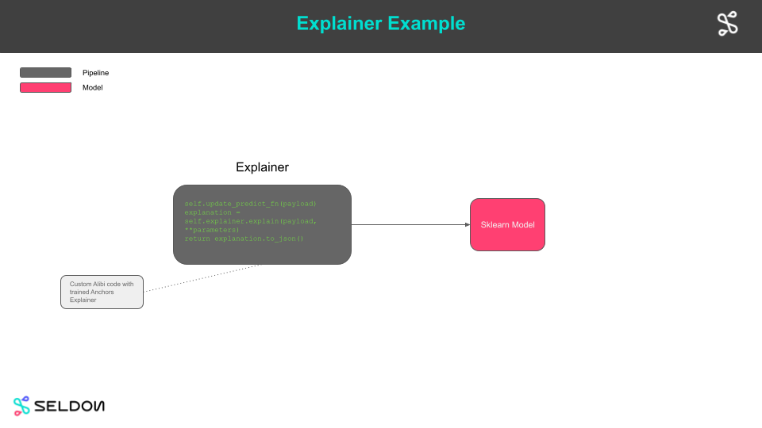

# Model Explainer Example



In this example we will:

  * [Describe the project structure](#Project-Structure)
  * [Train some models](#Train-Models)
  * [Create Tempo artifacts](#Create-Tempo-Artifacts)
  * [Run unit tests](#Unit-Tests)
  * [Save python environment for our classifier](#Save-Classifier-Environment)
  * [Test Locally on Docker](#Test-Locally-on-Docker)
  * [Production on Kubernetes via Tempo](#Production-Option-1-(Deploy-to-Kubernetes-with-Tempo))
  * [Prodiuction on Kuebrnetes via GitOps](#Production-Option-2-(Gitops))

## Prerequisites

This notebooks needs to be run in the `tempo-examples` conda environment defined below. Create from project root folder:

```bash
conda env create --name tempo-examples --file conda/tempo-examples.yaml
```

## Project Structure


```python
!tree -P "*.py"  -I "__init__.py|__pycache__" -L 2
```

    .
    ├── artifacts
    │   ├── explainer
    │   └── model
    ├── k8s
    │   └── rbac
    └── src
        ├── constants.py
        ├── data.py
        ├── explainer.py
        ├── model.py
        └── tempo.py
    
    6 directories, 5 files


## Train Models

 * This section is where as a data scientist you do your work of training models and creating artfacts.
 * For this example we train sklearn and xgboost classification models for the iris dataset.


```python
import os
import logging
import numpy as np
import json
import tempo

from tempo.utils import logger

from src.constants import ARTIFACTS_FOLDER

logger.setLevel(logging.ERROR)
logging.basicConfig(level=logging.ERROR)
```


```python
from src.data import AdultData

data = AdultData()
```


```python
from src.model import train_model

adult_model = train_model(ARTIFACTS_FOLDER, data)
```

    Train accuracy:  0.9656333333333333
    Test accuracy:  0.854296875


```python
from src.explainer import train_explainer

train_explainer(ARTIFACTS_FOLDER, data, adult_model)
```


    AnchorTabular(meta={
      'name': 'AnchorTabular',
      'type': ['blackbox'],
      'explanations': ['local'],
      'params': {'disc_perc': (25, 50, 75), 'seed': 1}}
    )


## Create Tempo Artifacts


```python
from src.tempo import create_explainer, create_adult_model

sklearn_model = create_adult_model()
Explainer = create_explainer(sklearn_model)
explainer = Explainer()
```


```python
# %load src/tempo.py
import os

import dill
import numpy as np
from alibi.utils.wrappers import ArgmaxTransformer
from src.constants import ARTIFACTS_FOLDER, EXPLAINER_FOLDER, MODEL_FOLDER

from tempo.serve.metadata import ModelFramework
from tempo.serve.model import Model
from tempo.serve.pipeline import PipelineModels
from tempo.serve.utils import pipeline, predictmethod


def create_adult_model() -> Model:
    sklearn_model = Model(
        name="income-sklearn",
        platform=ModelFramework.SKLearn,
        local_folder=os.path.join(ARTIFACTS_FOLDER, MODEL_FOLDER),
        uri="gs://seldon-models/test/income/model",
    )

    return sklearn_model


def create_explainer(model: Model):
    @pipeline(
        name="income-explainer",
        uri="s3://tempo/explainer/pipeline",
        local_folder=os.path.join(ARTIFACTS_FOLDER, EXPLAINER_FOLDER),
        models=PipelineModels(sklearn=model),
    )
    class ExplainerPipeline(object):
        def __init__(self):
            pipeline = self.get_tempo()
            models_folder = pipeline.details.local_folder

            explainer_path = os.path.join(models_folder, "explainer.dill")
            with open(explainer_path, "rb") as f:
                self.explainer = dill.load(f)

        def update_predict_fn(self, x):
            if np.argmax(self.models.sklearn(x).shape) == 0:
                self.explainer.predictor = self.models.sklearn
                self.explainer.samplers[0].predictor = self.models.sklearn
            else:
                self.explainer.predictor = ArgmaxTransformer(self.models.sklearn)
                self.explainer.samplers[0].predictor = ArgmaxTransformer(self.models.sklearn)

        @predictmethod
        def explain(self, payload: np.ndarray, parameters: dict) -> str:
            print("Explain called with ", parameters)
            self.update_predict_fn(payload)
            explanation = self.explainer.explain(payload, **parameters)
            return explanation.to_json()

    # explainer = ExplainerPipeline()
    # return sklearn_model, explainer
    return ExplainerPipeline

```

## Save Explainer


```python
!ls artifacts/explainer/conda.yaml
```

    artifacts/explainer/conda.yaml


```python
tempo.save(Explainer)
```

    Collecting packages...
    Packing environment at '/home/clive/anaconda3/envs/tempo-27d7d340-70df-4095-92b7-b9ef722eda26' to '/home/clive/work/mlops/fork-tempo/docs/examples/explainer/artifacts/explainer/environment.tar.gz'
    [########################################] | 100% Completed | 59.8s


## Test Locally on Docker

Here we test our models using production images but running locally on Docker. This allows us to ensure the final production deployed model will behave as expected when deployed.


```python
from tempo import deploy_local
remote_model = deploy_local(explainer)
```


```python
r = json.loads(remote_model.predict(payload=data.X_test[0:1], parameters={"threshold":0.90}))
print(r["data"]["anchor"])
```

    ['Marital Status = Separated', 'Sex = Female']


```python
r = json.loads(remote_model.predict(payload=data.X_test[0:1], parameters={"threshold":0.99}))
print(r["data"]["anchor"])
```

    ['Marital Status = Separated', 'Sex = Female', 'Capital Gain <= 0.00', 'Education = Associates', 'Age > 28.00']


```python
remote_model.undeploy()
```

## Production Option 1 (Deploy to Kubernetes with Tempo)

 * Here we illustrate how to run the final models in "production" on Kubernetes by using Tempo to deploy
 
### Prerequisites
 
Create a Kind Kubernetes cluster with Minio and Seldon Core installed using Ansible as described [here](https://tempo.readthedocs.io/en/latest/overview/quickstart.html#kubernetes-cluster-with-seldon-core).


```python
!kubectl apply -f k8s/rbac -n production
```

    secret/minio-secret configured
    serviceaccount/tempo-pipeline unchanged
    role.rbac.authorization.k8s.io/tempo-pipeline unchanged
    rolebinding.rbac.authorization.k8s.io/tempo-pipeline-rolebinding unchanged


```python
from tempo.examples.minio import create_minio_rclone
import os
create_minio_rclone(os.getcwd()+"/rclone-minio.conf")
```


```python
tempo.upload(sklearn_model)
tempo.upload(explainer)
```


```python
from tempo.serve.metadata import SeldonCoreOptions
runtime_options = SeldonCoreOptions(**{
        "remote_options": {
            "namespace": "production",
            "authSecretName": "minio-secret"
        }
    })
```


```python
from tempo import deploy_remote
remote_model = deploy_remote(explainer, options=runtime_options)
```


```python
r = json.loads(remote_model.predict(payload=data.X_test[0:1], parameters={"threshold":0.95}))
print(r["data"]["anchor"])
```

    ['Relationship = Unmarried', 'Marital Status = Separated', 'Capital Gain <= 0.00']


```python
remote_model.undeploy()
```

## Production Option 2 (Gitops)

 * We create yaml to provide to our DevOps team to deploy to a production cluster
 * We add Kustomize patches to modify the base Kubernetes yaml created by Tempo


```python
from tempo import manifest
from tempo.serve.metadata import SeldonCoreOptions
runtime_options = SeldonCoreOptions(**{
        "remote_options": {
            "namespace": "production",
            "authSecretName": "minio-secret"
        }
    })
yaml_str = manifest(explainer, options=runtime_options)
with open(os.getcwd()+"/k8s/tempo.yaml","w") as f:
    f.write(yaml_str)
```


```python
!kustomize build k8s
```

    apiVersion: machinelearning.seldon.io/v1
    kind: SeldonDeployment
    metadata:
      annotations:
        seldon.io/tempo-description: ""
        seldon.io/tempo-model: '{"model_details": {"name": "income-explainer", "local_folder":
          "/home/clive/work/mlops/fork-tempo/docs/examples/explainer/artifacts/explainer",
          "uri": "s3://tempo/explainer/pipeline", "platform": "tempo", "inputs": {"args":
          [{"ty": "numpy.ndarray", "name": "payload"}, {"ty": "builtins.dict", "name":
          "parameters"}]}, "outputs": {"args": [{"ty": "builtins.str", "name": null}]},
          "description": ""}, "protocol": "tempo.kfserving.protocol.KFServingV2Protocol",
          "runtime_options": {"runtime": "tempo.seldon.SeldonKubernetesRuntime", "state_options":
          {"state_type": "LOCAL", "key_prefix": "", "host": "", "port": ""}, "insights_options":
          {"worker_endpoint": "", "batch_size": 1, "parallelism": 1, "retries": 3, "window_time":
          0, "mode_type": "NONE", "in_asyncio": false}, "ingress_options": {"ingress":
          "tempo.ingress.istio.IstioIngress", "ssl": false, "verify_ssl": true}, "replicas":
          1, "minReplicas": null, "maxReplicas": null, "authSecretName": "minio-secret",
          "serviceAccountName": null, "add_svc_orchestrator": false, "namespace": "production"}}'
      labels:
        seldon.io/tempo: "true"
      name: income-explainer
      namespace: production
    spec:
      predictors:
      - annotations:
          seldon.io/no-engine: "true"
        componentSpecs:
        - spec:
            containers:
            - name: classifier
              resources:
                limits:
                  cpu: 1
                  memory: 1Gi
                requests:
                  cpu: 500m
                  memory: 500Mi
        graph:
          envSecretRefName: minio-secret
          implementation: TEMPO_SERVER
          modelUri: s3://tempo/explainer/pipeline
          name: income-explainer
          serviceAccountName: tempo-pipeline
          type: MODEL
        name: default
        replicas: 1
      protocol: kfserving
    ---
    apiVersion: machinelearning.seldon.io/v1
    kind: SeldonDeployment
    metadata:
      annotations:
        seldon.io/tempo-description: ""
        seldon.io/tempo-model: '{"model_details": {"name": "income-sklearn", "local_folder":
          "/home/clive/work/mlops/fork-tempo/docs/examples/explainer/artifacts/model",
          "uri": "gs://seldon-models/test/income/model", "platform": "sklearn", "inputs":
          {"args": [{"ty": "numpy.ndarray", "name": null}]}, "outputs": {"args": [{"ty":
          "numpy.ndarray", "name": null}]}, "description": ""}, "protocol": "tempo.kfserving.protocol.KFServingV2Protocol",
          "runtime_options": {"runtime": "tempo.seldon.SeldonKubernetesRuntime", "state_options":
          {"state_type": "LOCAL", "key_prefix": "", "host": "", "port": ""}, "insights_options":
          {"worker_endpoint": "", "batch_size": 1, "parallelism": 1, "retries": 3, "window_time":
          0, "mode_type": "NONE", "in_asyncio": false}, "ingress_options": {"ingress":
          "tempo.ingress.istio.IstioIngress", "ssl": false, "verify_ssl": true}, "replicas":
          1, "minReplicas": null, "maxReplicas": null, "authSecretName": "minio-secret",
          "serviceAccountName": null, "add_svc_orchestrator": false, "namespace": "production"}}'
      labels:
        seldon.io/tempo: "true"
      name: income-sklearn
      namespace: production
    spec:
      predictors:
      - annotations:
          seldon.io/no-engine: "true"
        graph:
          envSecretRefName: minio-secret
          implementation: SKLEARN_SERVER
          modelUri: gs://seldon-models/test/income/model
          name: income-sklearn
          type: MODEL
        name: default
        replicas: 1
      protocol: kfserving


```python

```
