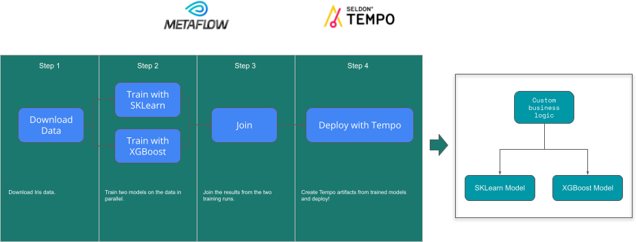

# End to End ML with Metaflow and Tempo

We will train two models and deploy them with tempo within a Metaflow pipeline. To understand the core example see [here](https://tempo.readthedocs.io/en/latest/examples/multi-model/README.html)



## MetaFlow Prequisites


### Install metaflow locally

```
pip install metaflow
```

### Setup Conda-Forge Support

The flow will use conda-forge so you need to add that channel to conda.

```
conda config --add channels conda-forge
```


## Iris Flow Summary


```python
!python src/irisflow.py --environment=conda show
```

## Run Flow locally to deploy to Docker


```python
!python src/irisflow.py --environment=conda run 
```

## Make Predictions with Metaflow Tempo Artifact


```python
from metaflow import Flow
import numpy as np
run = Flow('IrisFlow').latest_run
client = run.data.client_model
client.predict(np.array([[1, 2, 3, 4]]))
```

## Run Flow and Deploy to Remote Kubernetes

We will now run our flow and deploy Tempo artifacts onto a remote Kubernetes cluster. 

### Setup Metaflow

[Install Metaflow with remote AWS support](https://docs.metaflow.org/metaflow-on-aws/metaflow-on-aws).

### Seldon Requirements

For deploying to a remote Kubernetes cluster with Seldon Core installed do the following steps:

#### Install Seldon Core on your Kubernetes Cluster

Create a GKE cluster and install Seldon Core on it using [Ansible to install Seldon Core on a Kubernetes cluster](https://github.com/SeldonIO/ansible-k8s-collection).

### S3 Authentication
Services deployed to Seldon and Metaflow step code will need to access Metaflow S3 bucket to download trained models. The exact configuration will depend on whether you're using GKE or AWS EKS to run your cluster.

From the base templates provided below, create your `k8s/s3_secret.yaml`.

```yaml
apiVersion: v1
kind: Secret
metadata:
  name: s3-secret
type: Opaque
stringData:
  RCLONE_CONFIG_S3_TYPE: s3
  RCLONE_CONFIG_S3_PROVIDER: aws
  RCLONE_CONFIG_S3_BUCKET_REGION: <region>
  <...cloud-dependent s3 auth settings (see below)>
```

For GKE, to access S3 we'll need to add the following variables to use key/secret auth:
```yaml
  RCLONE_CONFIG_S3_ENV_AUTH: "false"
  RCLONE_CONFIG_S3_ACCESS_KEY_ID: <key>
  RCLONE_CONFIG_S3_SECRET_ACCESS_KEY: <secret>
```

For AWS EKS, we'll use the instance role assigned to the node, we'll only need to set one env variable:
```yaml
  RCLONE_CONFIG_S3_ENV_AUTH: "true"
```

We provide two templates to use in the `k8s` folder:

```
s3_secret.yaml.tmpl.aws
s3_secret.yaml.tmpl.gke
```

Use one to create the file `s3_secret.yaml` in the same folder

Create a Secret from the `k8s/s3_secret.yaml.tmpl` file by adding your AWS Key that can read from S3 and saving as `k8s/s3_secret.yaml`

```python
!kubectl create -f k8s/s3_secret.yaml -n production
```

## Setup RBAC and Secret on Kubernetes Cluster

These steps assume you have authenticated to your cluster with kubectl configuration

Create a namespace and set up RBAC for Seldon deployments
```python
!kubectl create ns production
```

```python
!kubectl create -f k8s/tempo-pipeline-rbac.yaml -n production
```

Create a namespace and set up RBAC for Metaflow batch jobs
```python
!kubectl create ns metaflow
```

```python
!kubectl create -f k8s/metaflow-pipeline-rbac.yaml -n production
```


## Run Metaflow

```python
!python src/irisflow.py \
    --environment=conda \
    --with kubernetes:image=seldonio/seldon-core-s2i-python37-ubi8:1.10.0-dev \
    run
```

## Make Predictions with Metaflow Tempo Artifact


```python
from metaflow import Flow
run = Flow('IrisFlow').latest_run
client = run.data.client_model
import numpy as np
client.predict(np.array([[1, 2, 3, 4]]))
```


```python

```
