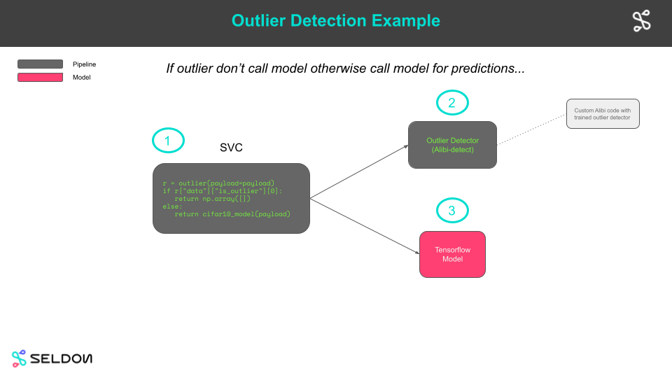

# Outlier Example



In this example we will:

  * [Describe the project structure](#Project-Structure)
  * [Train some models](#Train-Models)
  * [Create Tempo artifacts](#Create-Tempo-Artifacts)
  * [Run unit tests](#Unit-Tests)
  * [Save python environment for our classifier](#Save-Classifier-Environment)
  * [Test Locally on Docker](#Test-Locally-on-Docker)
  * [Production on Kubernetes via Tempo](#Production-Option-1-(Deploy-to-Kubernetes-with-Tempo))
  * [Prodiuction on Kuebrnetes via GitOps](#Production-Option-2-(Gitops))

## Prerequisites

This notebooks needs to be run in the `tempo-examples` conda environment defined below. Create from project root folder:

```bash
conda env create --name tempo-examples --file conda/tempo-examples.yaml
```

## Project Structure


```python
!tree -P "*.py"  -I "__init__.py|__pycache__" -L 2
```

## Train Models

 * This section is where as a data scientist you do your work of training models and creating artfacts.
 * For this example we train sklearn and xgboost classification models for the iris dataset.


```python
import os
from tempo.utils import logger
import logging
import numpy as np
logger.setLevel(logging.ERROR)
logging.basicConfig(level=logging.ERROR)
ARTIFACTS_FOLDER = os.getcwd()+"/artifacts"
```


```python
from src.data import Cifar10
data = Cifar10()
```

Download pretrained Resnet32 Tensorflow model for CIFAR10


```python
!rclone --config ./rclone-gcs.conf copy gs://seldon-models/tfserving/cifar10/resnet32 ./artifacts/model
```

Download or train an outlier detector on CIFAR10 data


```python
load_pretrained = True
if load_pretrained:  # load pre-trained detector
    !rclone --config ./rclone-gcs.conf copy gs://seldon-models/tempo/cifar10/outlier/cifar10 ./artifacts/outlier/cifar10
else:
    from src.outlier import train_outlier_detector
    train_outlier_detector(data, ARTIFACTS_FOLDER)
```

## Create Tempo Artifacts


```python
from src.tempo import create_outlier_cls, create_model, create_svc_cls
cifar10_model = create_model(ARTIFACTS_FOLDER)
OutlierModel = create_outlier_cls(ARTIFACTS_FOLDER)
outlier = OutlierModel()
Cifar10Svc = create_svc_cls(outlier, cifar10_model, ARTIFACTS_FOLDER)
svc = Cifar10Svc()
```


```python
# %load src/tempo.py
import json
import os

import numpy as np
from src.constants import MODEL_FOLDER, OUTLIER_FOLDER

from tempo.kfserving.protocol import KFServingV1Protocol, KFServingV2Protocol
from tempo.serve.metadata import ModelFramework
from tempo.serve.model import Model
from tempo.serve.pipeline import PipelineModels
from tempo.serve.utils import model, pipeline, predictmethod
from alibi_detect.base import NumpyEncoder


def create_outlier_cls(artifacts_folder: str):
    @model(
        name="outlier",
        platform=ModelFramework.TempoPipeline,
        protocol=KFServingV2Protocol(),
        uri="s3://tempo/outlier/cifar10/outlier",
        local_folder=f"{artifacts_folder}/{OUTLIER_FOLDER}",
    )
    class OutlierModel(object):

        def __init__(self):
            self.loaded = False

        def load(self):
            from alibi_detect.utils.saving import load_detector

            if "MLSERVER_MODELS_DIR" in os.environ:
                models_folder = "/mnt/models"
            else:
                models_folder = f"{artifacts_folder}/{OUTLIER_FOLDER}"
            print(f"Loading from {models_folder}")
            self.od = load_detector(f"{models_folder}/cifar10")
            self.loaded = True

        def unload(self):
            self.od = None
            self.loaded = False

        @predictmethod
        def outlier(self, payload: np.ndarray) -> dict:
            if not self.loaded:
                self.load()
            od_preds = self.od.predict(
                payload,
                outlier_type="instance",  # use 'feature' or 'instance' level
                return_feature_score=True,
                # scores used to determine outliers
                return_instance_score=True,
            )

            return json.loads(json.dumps(od_preds, cls=NumpyEncoder))

    return OutlierModel


def create_model(arifacts_folder: str):

    cifar10_model = Model(
        name="resnet32",
        protocol=KFServingV1Protocol(),
        platform=ModelFramework.Tensorflow,
        uri="gs://seldon-models/tfserving/cifar10/resnet32",
        local_folder=f"{arifacts_folder}/{MODEL_FOLDER}",
    )

    return cifar10_model


def create_svc_cls(outlier, model, arifacts_folder: str):
    @pipeline(
        name="cifar10-service",
        protocol=KFServingV2Protocol(),
        uri="s3://tempo/outlier/cifar10/svc",
        local_folder=f"{arifacts_folder}/svc",
        models=PipelineModels(outlier=outlier, cifar10=model),
    )
    class Cifar10Svc(object):
        @predictmethod
        def predict(self, payload: np.ndarray) -> np.ndarray:
            r = self.models.outlier(payload=payload)
            if r["data"]["is_outlier"][0]:
                return np.array([])
            else:
                return self.models.cifar10(payload)

    return Cifar10Svc

```

## Unit Tests

 * Here we run our unit tests to ensure the orchestration works before running on the actual models.


```python
# %load tests/test_tempo.py
from src.tempo import create_outlier_cls, create_model, create_svc_cls
import numpy as np


def test_svc_outlier():
    model = create_model("")
    OutlierModel = create_outlier_cls("")
    outlier = OutlierModel()
    Cifar10Svc = create_svc_cls(outlier, model, "")
    svc = Cifar10Svc()
    svc.models.outlier = lambda payload: {"data":{"is_outlier":[1]}}
    svc.models.cifar10 = lambda input: np.array([[0.2]])
    res = svc(np.array([1]))
    assert res.shape[0] == 0


def test_svc_inlier():
    model = create_model("")
    OutlierModel = create_outlier_cls("")
    outlier = OutlierModel()
    Cifar10Svc = create_svc_cls(outlier, model, "")
    svc = Cifar10Svc()
    svc.models.outlier = lambda payload: {"data":{"is_outlier":[0]}}
    svc.models.cifar10 = lambda input: np.array([[0.2]])
    res = svc(np.array([1]))
    assert res.shape[0] == 1
```


```python
!python -m pytest tests/
```

## Save Outlier and Svc Environments


```python
!cat artifacts/outlier/conda.yaml
```


```python
!cat artifacts/svc/conda.yaml
```


```python
from tempo.serve.loader import save
save(outlier)
save(svc)
```

## Test Locally on Docker

Here we test our models using production images but running locally on Docker. This allows us to ensure the final production deployed model will behave as expected when deployed.


```python
from tempo.seldon.docker import SeldonDockerRuntime
docker_runtime = SeldonDockerRuntime()
docker_runtime.deploy(svc)
docker_runtime.wait_ready(svc)
```


```python
from src.utils import show_image
show_image(data.X_test[0:1])
svc(payload=data.X_test[0:1])
```


```python
show_image(data.X_test[0:1])
svc.remote(payload=data.X_test[0:1])
```


```python
from src.utils import create_cifar10_outlier
outlier_img = create_cifar10_outlier(data)
show_image(outlier_img)
svc.remote(payload=outlier_img)
```


```python
docker_runtime.undeploy(svc)
```

## Production Option 1 (Deploy to Kubernetes with Tempo)

 * Here we illustrate how to run the final models in "production" on Kubernetes by using Tempo to deploy
 
### Prerequisites
 
 Create a Kind Kubernetes cluster with Minio and Seldon Core installed using Ansible from the Tempo project Ansible playbook.
 
 ```
 ansible-playbook ansible/playbooks/default.yaml
 ```


```python
!kubectl apply -f k8s/rbac -n production
```


```python
from tempo.examples.minio import create_minio_rclone
import os
create_minio_rclone(os.getcwd()+"/rclone-minio.conf")
```


```python
from tempo.serve.loader import upload
upload(cifar10_model)
upload(outlier)
upload(svc)
```


```python
from tempo.serve.metadata import RuntimeOptions, KubernetesOptions
runtime_options = RuntimeOptions(
        k8s_options=KubernetesOptions(
            namespace="production",
            authSecretName="minio-secret"
        )
    )
```


```python
from tempo.seldon.k8s import SeldonKubernetesRuntime
k8s_runtime = SeldonKubernetesRuntime(runtime_options)
k8s_runtime.deploy(svc)
k8s_runtime.wait_ready(svc)
```


```python
from src.utils import show_image
show_image(data.X_test[0:1])
svc.remote(payload=data.X_test[0:1])
```


```python
from src.utils import create_cifar10_outlier
outlier_img = create_cifar10_outlier(data)
show_image(outlier_img)
svc.remote(payload=outlier_img)
```


```python
k8s_runtime.undeploy(svc)
```

## Production Option 2 (Gitops)

 * We create yaml to provide to our DevOps team to deploy to a production cluster
 * We add Kustomize patches to modify the base Kubernetes yaml created by Tempo


```python
from tempo.seldon.k8s import SeldonKubernetesRuntime
k8s_runtime = SeldonKubernetesRuntime(runtime_options)
yaml_str = k8s_runtime.to_k8s_yaml(svc)
with open(os.getcwd()+"/k8s/tempo.yaml","w") as f:
    f.write(yaml_str)
```


```python
!kustomize build k8s
```


```python

```
