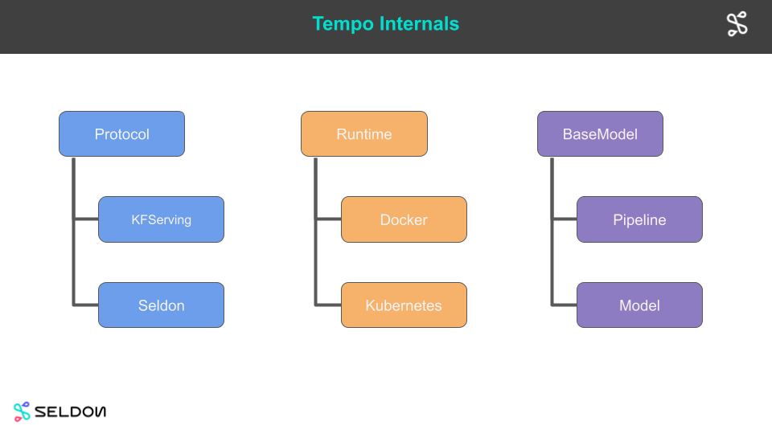
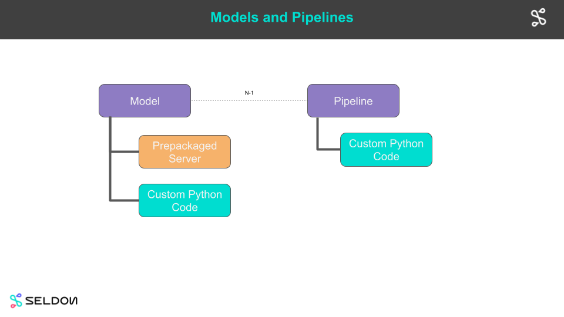
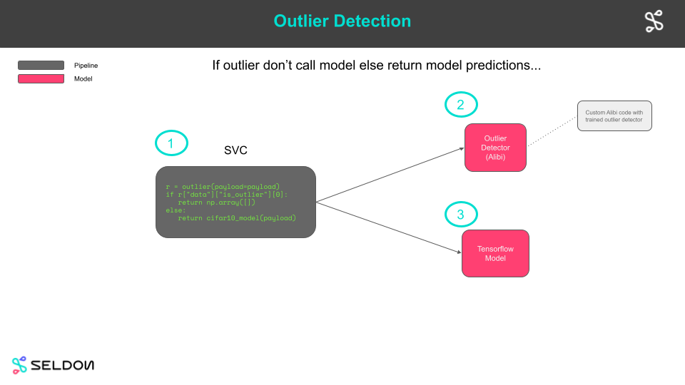

# Architecture

Overview of Tempo architecture.

## Model and Pipeline

A Model is the core deployment artifact in tempo and describes the link to a saved machine learning component. A Pipeline is a custom python orchestrator that references other Tempo models or pipelines specied in its definition.

A Model can be:

  * An optimized prepackaged server running a model artifact created by the data scientist, e.g. a Tensorflow model.
  * Custom python code (defined via a class or function).

A Pipeline is custom python code (defined via a class or function) which references other Tempo components as callable functions.

An example is shown below for the [outlier demo](../examples/outlier/README.html). There we have a Pipeline which calls the outlier model and if the request is determined to be an outlier then the processing is halted otherwise the model is called.

## Runtimes

Runtimes provide the core functionality to deploy a Tempo model to an infrastructure platform.

Read more about [Tempo Runtimes](./runtimes.html)

## Protocols

Models when deployed will expose endpoints that respect a particular protocol. The available protocols in Tempo are shown below.

| Protocol | Description |
|--------|---------|
| V2Protocol |  [V2 definition](https://github.com/kserve/kserve/tree/master/docs/predict-api/v2) |
| TensorflowProtocol | [Tensorflow protocol](https://github.com/tensorflow/serving/blob/master/tensorflow_serving/g3doc/api_rest.md) |
| SeldonProtocol | [Seldon protcol definition](https://docs.seldon.io/projects/seldon-core/en/latest/graph/protocols.html#rest-and-grpc-seldon-protocol) |

The default protocol is the V2 protocol.

If calling the model with tempo you will not need to deal with the protocol explicitly as translation from the defined python types to runtime payloads and vice versa  will be automatic.
