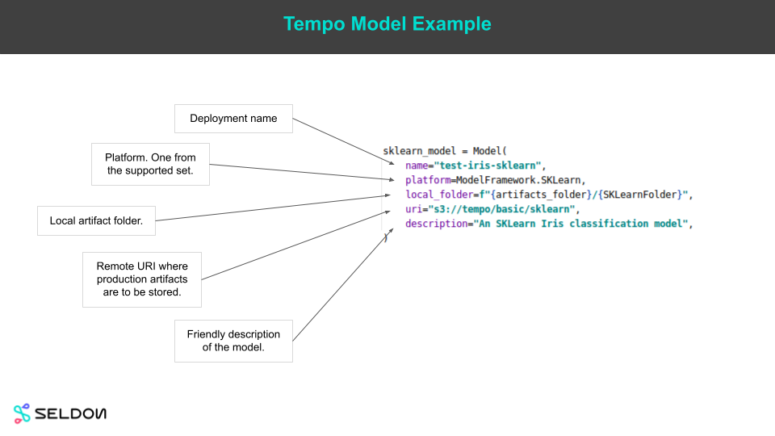

# Tempo Overview

Tempo is a python SDK for data scientists to help them move their models to production. It has 4 core goals:

  1. Data science friendly.
  2. Pluggable runtimes.
  3. Custom python inference components.
  4. Powerful orchestration logic.

A simple model example is shown below. A data scientist need only fill some core details about their trained model.

Tempo allows you to combine business logic as custom python with models served on optimized servers.

In the example below:

  1. Train your sklearn model
  2. Train your xgboost model
  3. Create python logic to orchestrate the two

The Tempo code for the above example is shown below:

The steps to use tempo would be:

 1. Local training and unit tests
 2. Local tests of inference on Docker
 3. Push to production runtime, e.g. Kubernetes with Seldon Core

